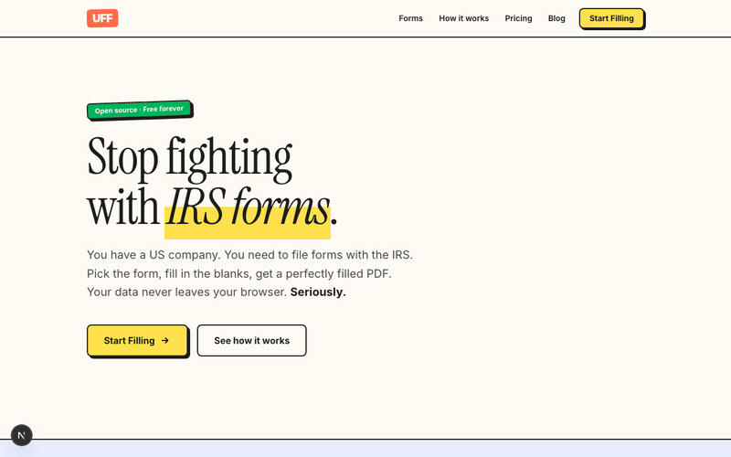
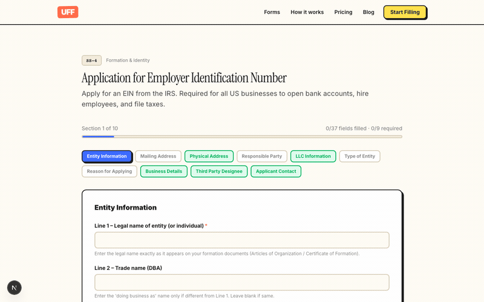
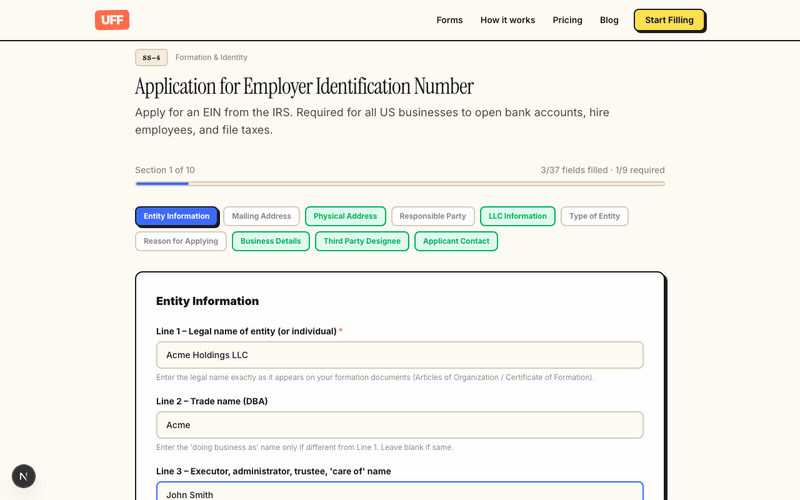

<div align="center">

# UFF

**US Form Filling — IRS form filling made simple.**

Fill IRS tax forms in your browser. Pick a form, fill the fields, download the PDF.
Your data never leaves your browser.

[](LICENSE)
[](https://usformfiller.vercel.app)

[Live App](https://usformfiller.vercel.app) &middot; [Blog](https://usformfiller.vercel.app/blog) &middot; [Report Bug](https://github.com/incube-vault/uff/issues)



</div>

---

## Why

You formed a US company. Now you need to file SS-4, Form 8832, Form 1120, and a dozen other IRS forms. Most founders end up squinting at 4-page PDFs trying to figure out which box is which.

UFF gives you a clean, guided form for each IRS document. Fill the fields, hit download, get a perfectly filled official PDF. No signup, no accounts, no data stored anywhere.

## Demo

| Fill the fields | Download PDF |
|:---------------:|:------------:|
|  |  |

## Forms

12 IRS & FinCEN forms across 6 categories:

| Category | Forms |
|----------|-------|
| Formation & Identity | SS-4, Form 8832 |
| Foreign-Owned LLC | Form 1120, Form 5472 |
| Partnership | Form 1065, Schedule K-1 |
| Compliance & Ownership | FinCEN BOI |
| Individual & Withholding | Form 1040-NR, W-8BEN, W-8BEN-E |
| Extensions | Form 7004, Form 4868 |

## Tech Stack

- **Frontend** — Next.js 15, React 19, TypeScript, Tailwind CSS 4
- **Backend** — FastAPI, Python 3.13
- **PDF** — pdf-lib (client), PyMuPDF + ReportLab (server)
- **Deploy** — Vercel

## Getting Started

### Prerequisites

- [Node.js](https://nodejs.org/) 25+
- [Python](https://python.org/) 3.13+
- [mise](https://mise.jdx.dev/) (optional, manages Node/Python versions)

### Setup

```bash
# Clone
git clone https://github.com/incube-vault/uff.git
cd uff

# If using mise (recommended)
mise install

# Frontend
npm install
npm run dev

# Backend (separate terminal)
cd api
python -m venv .venv
source .venv/bin/activate
pip install -r requirements.txt
uvicorn main:app --reload --port 8000
```

Open [http://localhost:3000](http://localhost:3000) — the frontend proxies `/api` requests to the FastAPI backend.

### One-liner (if you just want to try it)

```bash
git clone https://github.com/incube-vault/uff.git && cd uff && npm i && npm run dev
```

> The frontend works standalone for browsing forms. The backend is needed for PDF generation.

## Deploy

[](https://vercel.com/new/clone?repository-url=https://github.com/incube-vault/uff)

The project deploys to Vercel out of the box — Next.js frontend + Python API serverless functions.

## Project Structure

```
uff/
├── src/
│   ├── app/            # Next.js pages (home, forms, blog, pricing)
│   ├── components/     # React components (Header, Footer, FormFiller)
│   └── lib/            # Form definitions, blog posts
├── api/
│   └── main.py         # FastAPI backend (PDF filling)
├── public/
│   └── pdfs/           # Official IRS PDF templates
└── package.json
```

## Contributing

Contributions are welcome. Here are some ways to help:

- **Add a new form** — Define it in `src/lib/forms.ts`, add the PDF template to `public/pdfs/`
- **Write a blog post** — Add it to `src/lib/blog-posts.ts`
- **Fix a bug** — Check [open issues](https://github.com/incube-vault/uff/issues)
- **Improve UI** — The design follows a [37signals](https://hey.com)-inspired style

```bash
# Run the dev server
npm run dev

# Build for production
npm run build

# Lint
npm run lint
```

## Privacy

UFF processes everything in the browser. No analytics, no tracking, no cookies, no accounts. Your tax data is never sent to any server (PDF generation uses the official IRS templates locally). Close the tab and your data is gone.

## License

[Apache 2.0](LICENSE) — use it however you want.

---

<div align="center">

**[usformfiller.vercel.app](https://usformfiller.vercel.app)**

Built for international founders tired of fighting with IRS forms.

</div>
